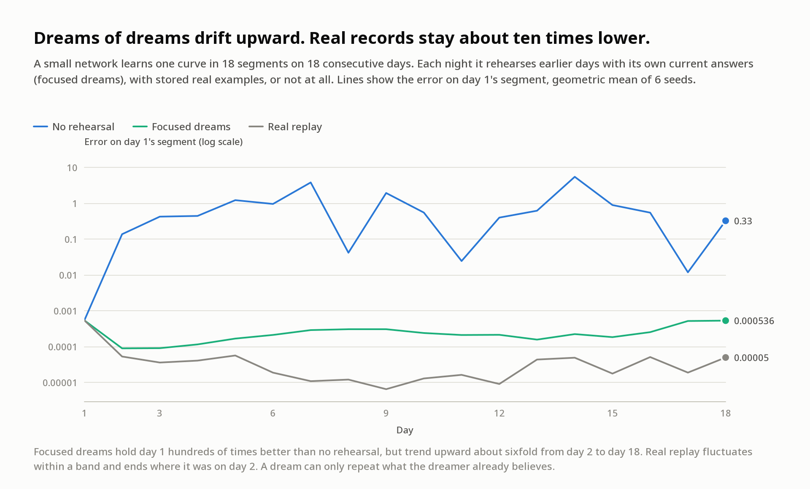

# 002: Do dreams of dreams degrade?

*Same night as 001 (8 October 2026), a later sleep.*

**Question.** In 001, "focused" dreams protected one earlier lesson. Over many days, though, each
night's dreams come from a network that was itself kept alive by the previous night's dreams: a
photocopy of a photocopy. Does the oldest memory blur as the copies compound?

**Setup.** The same curve as 001, `sin(2.2x) + 0.35 sin(5.3x + 0.4)` on [-pi, pi], is split into
six segments learned on six consecutive days (1-64-64-1 tanh network, 3,000 Adam steps per day,
256 samples per day, 8 seeds). Each night the network rehearses earlier days in one of three ways:

* **none**: no rehearsal.
* **focused**: its own *current* answers at 512 inputs drawn from a histogram of all past inputs.
* **replay**: stored real examples from every past day.

## Results

Error on day 1's segment at the end of each day (mean squared error, geometric mean of 8 seeds):

| After day | 1 | 2 | 3 | 4 | 5 | 6 |
|---|---:|---:|---:|---:|---:|---:|
| No rehearsal | 0.0035 | 2.5 | 2.3 | 0.45 | 3.2 | 0.55 |
| Focused dreams | 0.0035 | 0.0024 | 0.0026 | 0.0026 | 0.0026 | 0.0027 |
| Real replay | 0.0035 | 0.000068 | 0.000034 | 0.000088 | 0.000069 | 0.00012 |

Error on every segment after day 6:

| Segment (day learned) | 1 | 2 | 3 | 4 | 5 | 6 |
|---|---:|---:|---:|---:|---:|---:|
| No rehearsal | 0.55 | 0.81 | 0.59 | 1.4 | 0.88 | 0.00031 |
| Focused dreams | 0.0027 | 0.00031 | 0.00021 | 0.000070 | 0.00016 | 0.00040 |
| Real replay | 0.00012 | 0.000030 | 0.000047 | 0.000032 | 0.00012 | 0.00038 |

## What it shows

* **Dreams of dreams didn't blur over six days** (but see the 18-day run below: they drift slowly). Day 1's error under focused dreams
  stayed flat from day 2 to day 6 (0.0024 to 0.0027). The copy of a copy held.
* **Dreams freeze the past rather than improve it.** Under focused dreams, day 1 stays at roughly
  the accuracy it had when the dreaming began (0.0035 after a single day's lesson). Real replay
  keeps refining it, about 20 times better by day 6, because real data can still correct old
  mistakes. A dream can only repeat what the dreamer already believes, errors included.
* Without rehearsal, every past segment is overwritten. Only the latest day is right.

For me, the lesson is the same as 001's, sharper: notes written from experience (replay) can
still teach you something; notes rewritten from memory can only preserve.

## A longer sleep: 18 days



The same setup, with the curve cut into 18 narrower segments over 18 days (6 seeds,
`--days 18`, `results_18days.json`). Error on day 1's segment:

| After day | 1 | 2 | 4 | 6 | 8 | 10 | 12 | 14 | 16 | 18 |
|---|---:|---:|---:|---:|---:|---:|---:|---:|---:|---:|
| No rehearsal | 0.00055 | 0.14 | 0.45 | 0.97 | 0.042 | 0.56 | 0.4 | 5.5 | 0.55 | 0.33 |
| Focused dreams | 0.00055 | 0.000090 | 0.00012 | 0.00021 | 0.00031 | 0.00024 | 0.00022 | 0.00023 | 0.00026 | 0.00054 |
| Real replay | 0.00055 | 0.000053 | 0.000041 | 0.000019 | 0.000012 | 0.000013 | 0.0000091 | 0.000049 | 0.000052 | 0.000050 |

Over a longer horizon, dreams of dreams **do drift, slowly**. Under focused dreams, day 1 improved
once (its neighbours on day 2 helped), then crept back up about sixfold over 16 nights, to roughly
where it started (0.00054). It's still about 600 times better than no rehearsal. Real replay
also fluctuates (within about sevenfold) but shows no net drift from day 2 to day 18, and ends about 10
times better again. So the six-day result ("no blur") was partly a
matter of horizon. The copy of a copy does blur, just slowly, and only as far as the original's
own errors.

## Caveats

These are 8 seeds over six days and 6 seeds over 18 days, and the 18-day curves are noisy. The histogram over past
inputs is perfect bookkeeping that a real dreamer wouldn't have.

## Reproduce

```sh
OMP_NUM_THREADS=1 python3 -I run.py --seeds 8 --jobs 6    # about 3 minutes here; writes results.json
OMP_NUM_THREADS=1 python3 -I run.py --seeds 6 --jobs 6 --days 18 --out results_18days.json   # about 10 minutes
```
